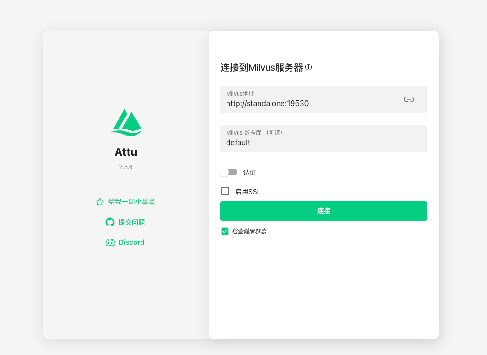
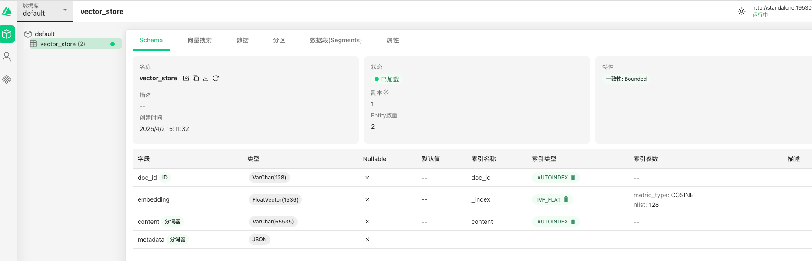

1. docker启动milvus服务[https://github.com/future0923/ai-agent-example/blob/main/docker-compose/milvus/docker-compose.yaml](https://github.com/future0923/ai-agent-example/blob/main/docker-compose/milvus/docker-compose.yaml)
2. 访问[http://localhost:8000/](http://localhost:8000/)

3. 在数据库 `default` 下创建 `vector_store` 的 Collection

4. 访问 `add` 接口增加了数据
